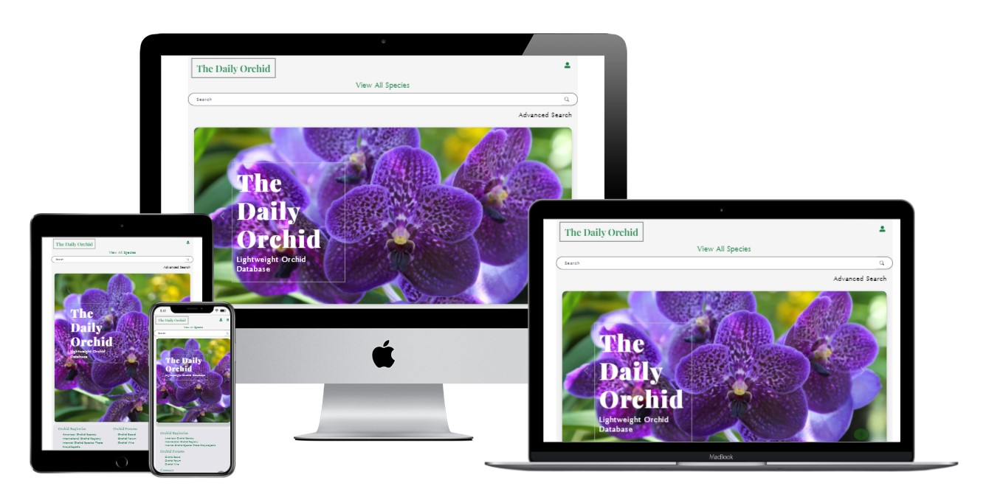

# The Daily Orchid - Frontend

 

[Trent Global College](https://www.trentglobal.edu.sg/)
 * Software Development BootCamp
 * Diploma in Web Application Development
 * Project 2

The live demo can be found at [https://the-daily-orchid.netlify.app](https://the-daily-orchid.netlify.app).

Backend repository is [here](https://github.com/caracara6/project2).

## Summary

**Context**
The Daily Orchid is a mobile-responsive lightweight orchid database single page application platform for users to discover orchid species and add favourites to their account, and for orchid-growers to share their own hybrids with the world.

**Justification for the App**
This web app is akin to a mini-Wikipedia, a lightweight platform with information presented in easy-to-digest nuggets. The features are also self-explanatory and simple-to-use. This makes it easy for users to share information with others. Anyone is able to post and edit, stoking the community spirit of sharing and learning.

## UI/UX

### **Strategy**

_Organisation_
* Objective: To raise awareness and educate the public about orchids, and encourage users to share knowledge about their favourite orchids. To also set up an online community of orchid-lovers.

_User_
* Objective: Learn of new orchid species (800 genera and 30000 species in the world) hitherto unbeknownst to them. Share knowledge of other species and append to the database to enrich other users. Share their own orchid hybrid creations with the world. Discover information about species which can further fuel their love for orchids. Edit existing incorrect information about a species in the database.
 

* Needs: Platform with simple features such as checkboxes and dropdowns which allows for easy sharing
 

* Demographics:
    * Orchid lovers who are already knowledgeable about the orchid family and many species
    * Users who may not be as knowledgeable about the orchid family, but are enthusiastic about learning and sharing
    * Orchid-growers who have hybridised their own creations
 

* Pain point: Can be intimidating to post/edit/delete content on a full-fledged sharing website such as Wikipedia
 

User Stories | Acceptance Criteria
------------ | -------------------
As a user curious about the world of orchids and is looking for succinct information, I want to be able to easily explore and retrieve what I'm searching for. | Simple and self-explanatory interface with multiple search-filtering functions(including orchid's common name, genus, species, colours, native distribution, conservation status, and number of facts added by other users) to cater to specific search criteria.
As an orchid-enthusiast who possesses intermediate to in-depth knowledge about the orchid family, I want to be able to access a platform which allows me to easily share my knowledge with others in the community. | By adopting straightforward UI components such as select dropdowns and checkboxes, posting, editing, and deleting on The Daily Orchid can be performed conveniently by anyone who wishes to contribute.

### **Scope**
_Functional Requirements_
* Post, filter and search for, display, edit, and delete orchid species listings

* Post, display, edit, and delete facts specific to an orchid species

* Create account using email, display current account email, update email, delete account

* Save/remove favourite orchid species to/from account

_Content Requirements_
* Posting a new species input fields(mandatory and optional) : species common name, genus, colours, scents, pattern of the petals, floral grouping, year of creation/discovery, creator/founder's name, photo URL, native distribution, conservation status

_Non-functional requirements_
* Mobile responsiveness
    * Achieved by employing Bootstrap components and CSS flex

* SPA - Single Page Application

### **Structure**

### **Skeleton**

Mockup wireframes can be found [here](https://miro.com/app/board/uXjVO-d1TFo=/?share_link_id=567236757606).

### **Surface**

_Colour Palette_

 

* Colours chosen are muted shades of green except for one accent colour of HEX #537EE0 (rightmost in picture above). This artistic direction follows the educational setting of the web app, and is deliberately taken to allow the colourful orchids to take center stage. The varying green shades also reflect the calming nature of plant life. 

_Font Choices_

* [Playfair Display](https://fonts.google.com/specimen/Playfair+Display?query=playfair&category=Serif,Display), a bold, eye-catching serif display font is used for the hero component 
 

* [Spectral](https://fonts.google.com/specimen/Spectral?query=spectral&category=Serif,Display), another serif font, is used with appropriate font-weight where emphasis is needed, such as when drawing attention to card titles. Font-styles are also changed to italics when required, such as displaying orchid genera
 

* [Oregon LDO Medium](https://www.fontspace.com/oregon-ldo-font-f1678), sans-serif, is used for the functional text in the main body. Letter-spacing is applied where applicable for better readability

_Layout_

* Hero component features an asymmetrical layout where font is placed to the side. This breaks the monotony of centralised display and also allows a clearer view of the images.
 

* Results page is a combination of grid and card layout. The grid design has been proven time and again to offer users the UX of easy browsing. The cards choice was to offer bites of information, with the user having the ability to view more depending on what piques his/her interest

## Features

1. **Users can search through the database.** The searchbar allows users to search by text. The advanced search filters include: colours, native distribution, conservation status, and number of facts added by other users. These are constructed with select dropdowns and checkboxes.
 

2. **Users can do CRUD - create, read, update, delete - for the species collection.** The call to action for listing a new species is on the results page. This will be done via a form which prompts short pieces of information, and is the same for editing a currently-listed species in the database. Users can choose to edit, or delete a listing completely if it contains too many information fields not pertinent to the direction of the web app.
 

3. **Users can do CRUD - create, read, update, delete - for facts of a specific species.** If a species has been listed, users can then add fun facts in the form of short pieces of information via a text box. Similarly, users can choose to edit or delete facts with duplicate content.
 

4. **Users can do CRUD - create, read, update, delete - for their account.** Users can sign up for an account using their email. Verification is in place to ensure it has the correct email format, and to prevent two users from using the same email. This also applies when users wish to change their email. With an account, users can now add/remove favourites.

_Limitations and future implementations_

* In order to achieve the simple-to-use-interface, some information inputs are generalised into categories, such as the native distribution, colours, and scents. Many orchid species are endemic to specific areas of the globe, such as Borneo and Madagascar, and scents and colours are richly subjective to each person's experiences. However, I believe the choice to streamline these inputs is important so as to ease the filtering for results, and is in line with this project being a lightweight database.
 

* Considering there are approximately 30000 orchid species in the world, the database will increase in size in future depending on user participation. This can overload the web app as axios fetches all the data with every get request, and slow down the app. Thus, pagination will be helpful in ensuring a smoother UX. 
 

* Due to time limitations and the scope of this project, I did not follow through with the original intent of having separate pages with information of orchid native distributions and conservation statuses, each of which are standalone static collections in this project's database. I'd definitely like to implement this in future.

## Testing

Description | Steps | Expected Result
----------- | ----- | ---------------
Viewing all orchid species | On the main page, user clicks on "View All Species" nav tab | Inside content container of the SPA, users will be directed to a page listing all the species in this project's database
Viewing a specific species | Each orchid displayed with a card with brief information. Users can choose to view more information about a specific species by accessing the "About this species" link at the bottom of each card | A modal will render with the selected species' information in a neat table format. 
Posting a new orchid species | On the "View All Species" page, users can access the link to add content | Users will be directed to the posting form. Upon submission, they will be redirected to the "View All Species" page, where their submission will be updated automatically
Editing an existing species listing | Users can perform this task by accessing the edit button at the bottom of the species modal | They will be directed to a form containing the existing information about this species. Similar to posting, upon submission, the updated information will be reflected without having to refresh the page.
Users logging in | Users can click on the user icon on the main page and select "Log in" | If users log in with an email saved in the database, they will be successful. If not, they will be unable to log in with a meassage indicating that that email is not registered with the website
Users creating account |  Users can click on the user icon on the main page and select "Create Account" | If users try to create an account with an invalid email, an error message will prompt them for a valid input. If a duplicate email is used, the error message will reflect this accordingly. If they create an acccount, they will be logged in automatically
Users adding favourites | Users can do do by clicking on the heart button at the bottom of the species modal | Should a user try adding a favourite without first creating an account, they will be be blocked from doing so, and a message will prompt them to create an account. With an account, they can now toggle the heart button to add or remove a species from their favourites
Users viewing their saved favourites | Users can click on the user icon on the main page and select "View favourites" | If users have saved favourites, they will be reflected here. If not, a message will reflect that they have zero saved favourites

## Technologies Used

* [Reactjs](https://reactjs.org/)
    * Library for building reactive user interfaces

* [HTML5](https://www.w3.org/standards/webdesign/htmlcss)
    * For general styling and layout

* [CSS3](https://www.w3.org/standards/webdesign/htmlcss)
    * For general styling and layout

* [Bootstrap v5.1.1](https://getbootstrap.com/docs/5.0/getting-started/introduction/)
    * Library of styled components

* [GitHub](http://github.com)
    * Source code storage

* [Git](https://git-scm.com/)
    * Version control

* [Heroku](https://id.heroku.com/login)
    * API host

* [MongoDB Atlas](https://www.mongodb.com/)
    * Cloud database

* [Axios](https://cdnjs.com/libraries/axios)
    * Library for handling HTTP requests

* [Netlify](https://www.netlify.com/)
    * Used for front-end deployment

* [Google Fonts](https://fonts.google.com/)
    * Fonts are used in styling direction

* [React Icons](https://react-icons.github.io/react-icons/)
    * Icons used are taken from this library

## Deployment

* Deployment instructions for Netlify can be found [here](https://www.netlify.com/blog/2016/07/22/deploy-react-apps-in-less-than-30-seconds/).

## Acknowledgements

* All images are from Google Search

* My cute and helpful classmates